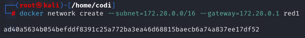

# PPSUnidad0Actividad6-CursoDockerPabloGil

<h1>Redes</h1>

<h2>Trabajar con redes docker</h2>

<i>Red1

Nombre: red1
Dirección de red: 172.28.0.0
Máscara de red: 255.255.0.0
Gateway: 172.28.0.1</i>

<i>Red2

Nombre: red2
Es resto de los datos será proporcionados automáticamente por Docker.</i>

