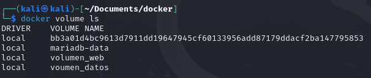

<h1>Ejercicios Entrega Almacenamiento</h1>

<b><i>• Pantallazo donde se puedan ver los dos volúmenes creados.

<b><i>• Pantallazo con la orden correspondiente para arrancar el contenedor c1 usando el volumen_web.

<b><i>• Pantallazo con la orden correspondiente para arrancar el contenedor c2 usando el volumen_datos.

<b><i>• Pantallazo donde se vea el proceso para poder borrar el volumen_datos.

<b><i>• Pantallazo donde se vea el borrado de c1 y la creación de c3.

