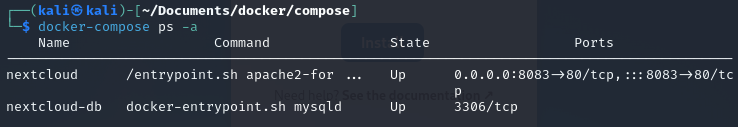
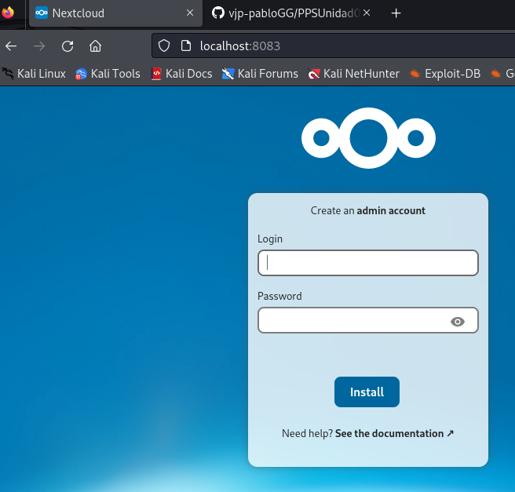

<h1>Ejercicios Escenario Multicontenedor</h1>

<h2>Despliegue de Nextcloud</h2>

<b><i>• Pantallazo donde se vea el fichero docker-compose.yaml.

<b><i>• Pantallazo donde se vea los contenedores funcionando con la instrucción docker-compose.

<b><i>• Pantallazo donde se vea el acceso desde el navegador a la aplicación.

