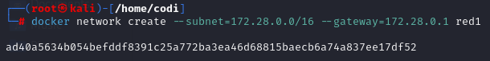
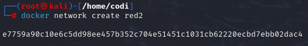
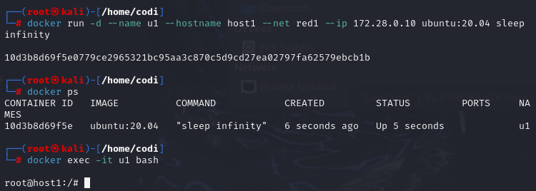
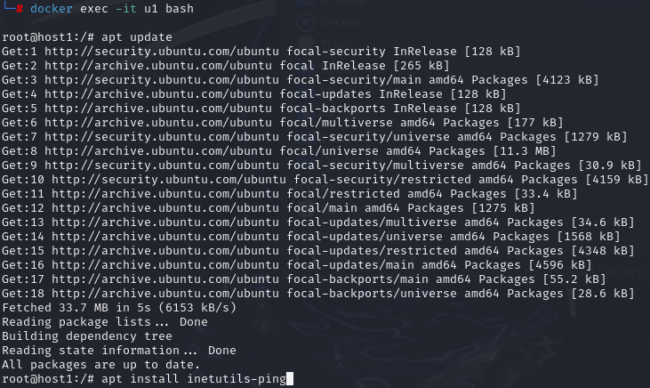
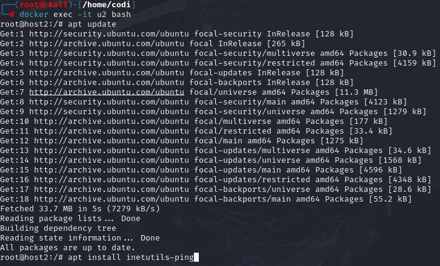
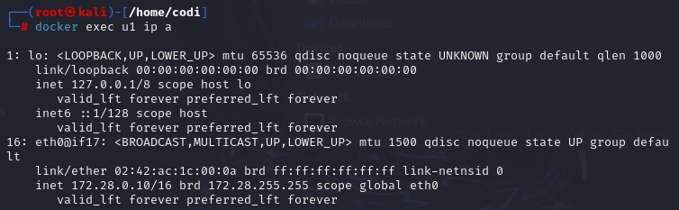
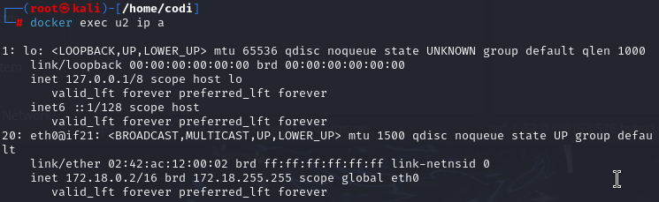
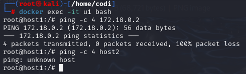
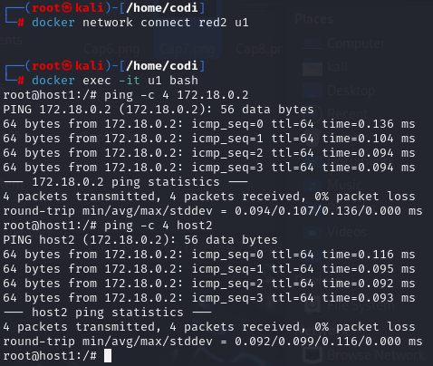

<h1>Redes</h1>

<h2>Trabajar con redes docker</h2>

<i>Red1

Nombre: red1
Dirección de red: 172.28.0.0
Máscara de red: 255.255.0.0
Gateway: 172.28.0.1</i>

<i>Red2

Nombre: red2
Es resto de los datos será proporcionados automáticamente por Docker.</i>

<h3>1. Poner en ejecución un contenedor de la imagen ubuntu:20.04 que tenga como hostname host1, como IP 172.28.0.10 y que esté conectado a la red1. Lo llamaremos u1.</h3>

<h3>2. Entrar en ese contenedor e instalar la aplicación ping (apt update && apt install inetutils-ping).</h3>

<h3>3. Poner en ejecución un contenedor de la imagen ubuntu:20.04 que tenga como hostname host2 y que esté conectado a la red2. En este caso será docker el que le de una IP correspondiente a esa red. Lo llamaremos u2.</h3>

<h3>4. Entrar en ese contenedor e instalar la aplicación ping (apt update && apt install inetutils-ping).</h3>

<h2>Pantallazos</h2>

<i>• Pantallazo donde se vea la configuración de red del contenedor u1.</i>

<i>• Pantallazo donde se vea la configuración de red del contenedor u2.</i>

<i>• Pantallazo donde desde cualquiera de los dos contenedores se pueda ver que no podemos hacer ping al otro ni por ip ni por nombre.</i>

<i>• Pantallazo donde se pueda comprobar que si conectamos el contenedor u1 a la red2 (con docker network connect), desde el contenedor u1, tenemos acceso al contenedor u2 mediante ping, tanto por nombre como por ip.</i>

